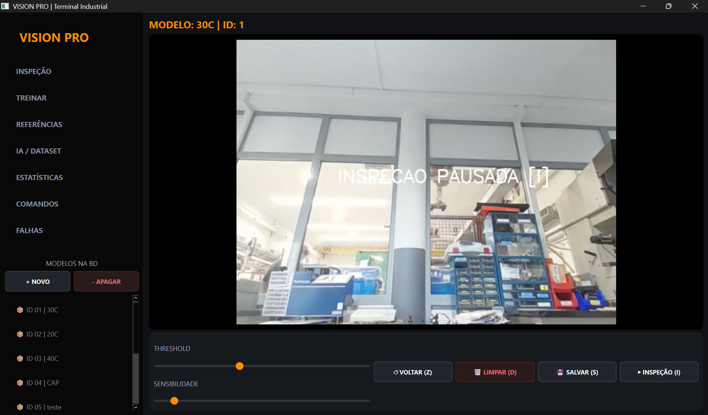
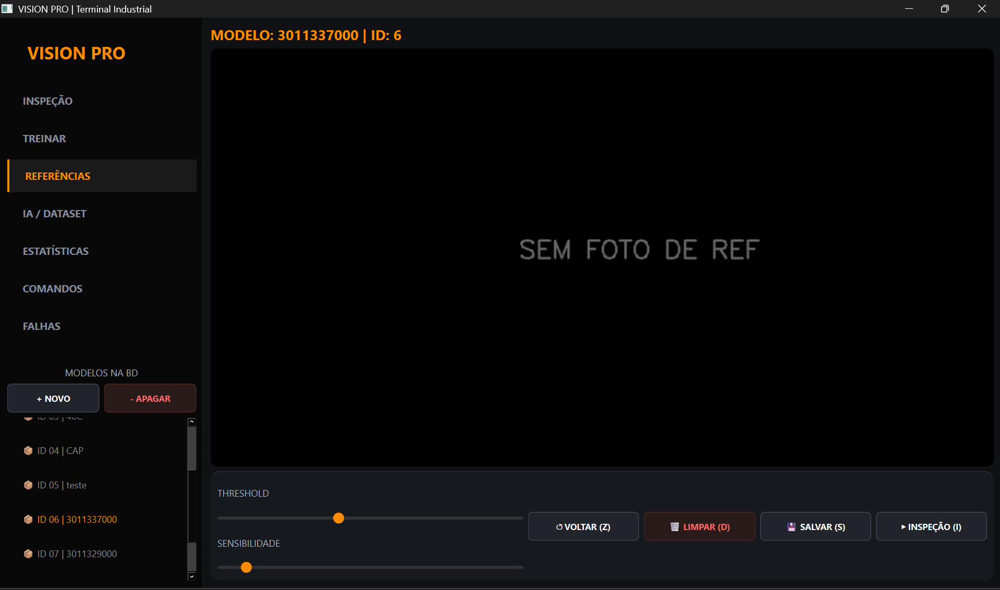
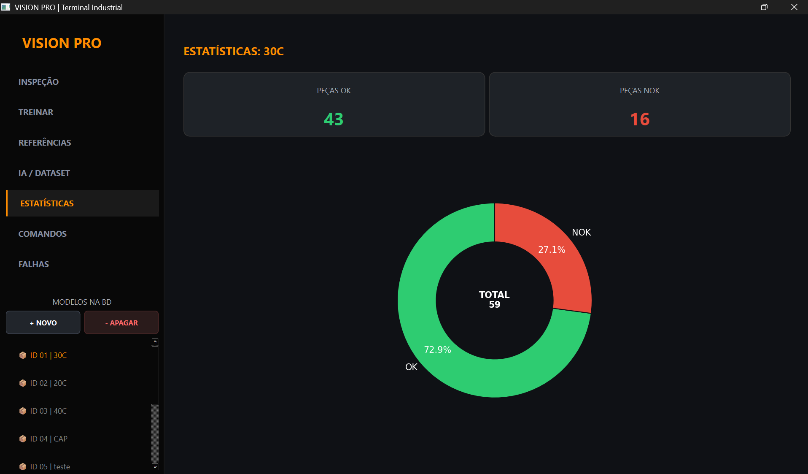
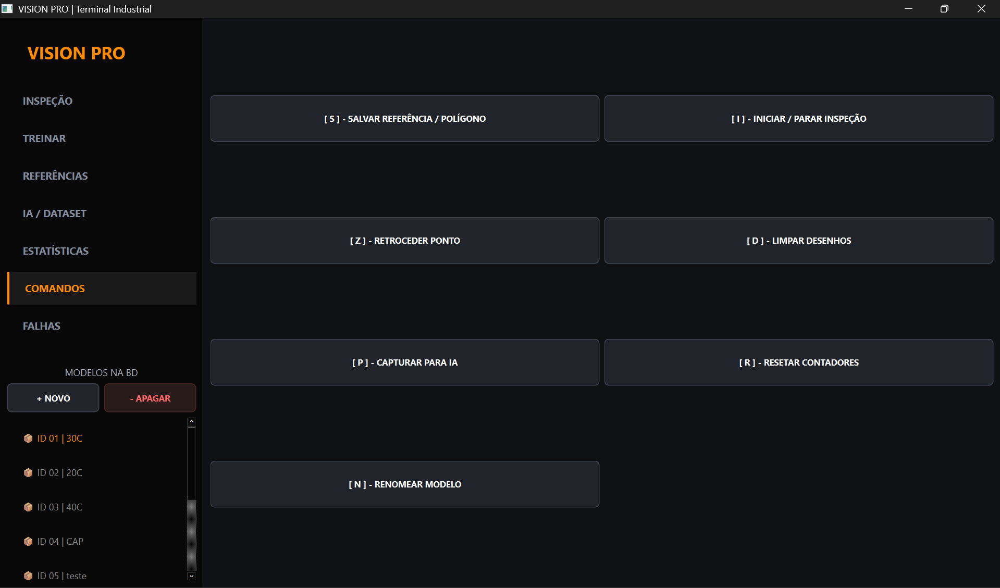
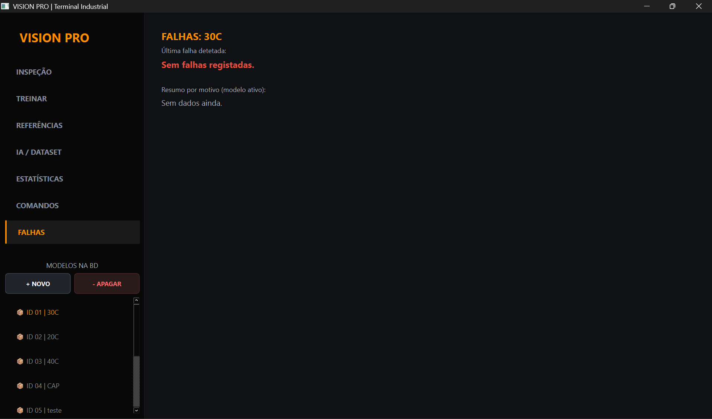
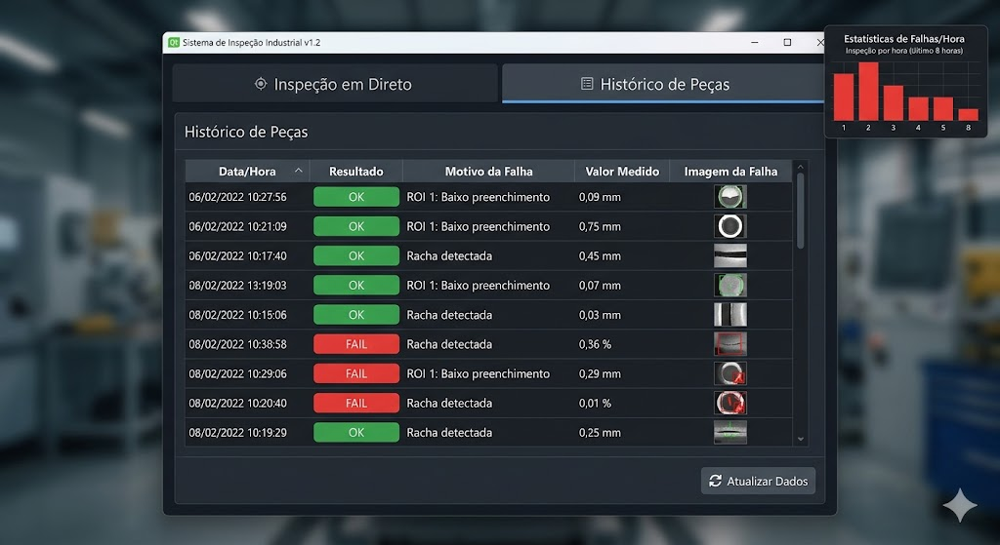

# VISION PRO | Terminal Industrial de Visão Computacional

- Menu principal 


- Menu de referencia



- Menu de estatisticas 


- Menu de comandos 


- Menu de falhas

- 
## 📌 Visão Geral
O **VISION PRO** é uma solução robusta de inspeção industrial que combina técnicas clássicas de processamento de imagem com o estado da arte em Deep Learning. Desenvolvido para operar em linhas de produção, o sistema automatiza a deteção de defeitos, contagem de peças e validação dimensional, reduzindo a margem de erro humano e aumentando a cadência produtiva.

---

## 🚀 Funcionalidades Detalhadas

### 1. Sistema de Inspeção Híbrido
O software opera em duas frentes complementares:
*   **Análise Geométrica (Classic CV):** Utiliza polígonos definidos pelo utilizador para validar a forma e presença de componentes específicos.
*   **Deteção por IA (YOLOv8):** Identifica e classifica peças automaticamente, mesmo com variações de iluminação, rotação ou oclusão parcial.

### 2. Interface Homem-Máquina (HMI) Profissional
*   **Dashboard em Tempo Real:** Visualização do fluxo de vídeo com overlays dinâmicos indicando o status (OK/NOK).
*   **Gestão de Referências:** Sistema de "Receitas" onde cada peça tem o seu próprio perfil de tolerância, polígonos de treino e pesos de IA.
*   **Painel de Estatísticas Avançadas:** Gráficos de barras e linhas que mostram a produtividade horária e os motivos mais frequentes de rejeição.

### 3. Engine de Processamento de Imagem
*   **CLAHE (Contrast Limited Adaptive Histogram Equalization):** Algoritmo aplicado para normalizar a iluminação e destacar detalhes em peças metálicas ou escuras.
*   **Filtragem HSV:** Deteção precisa de cores industriais através de segmentação no espaço de cores HSV, menos sensível a reflexos.
*   **Auto-Labeling:** Ferramenta integrada que gera automaticamente ficheiros de anotação (.txt) para o YOLO enquanto o operador captura fotos da peça.

---

## 🛠️ Stack Tecnológica e Arquitetura

*   **Core Engine:** `Python 3.10+`
*   **GUI Framework:** `PySide6 (Qt6)` - Garante uma interface fluida, com suporte a multithreading para não bloquear o vídeo durante o processamento.
*   **Visão Computacional:** `OpenCV 4.x` - Responsável pelo pré-processamento, filtragem e desenho geométrico.
*   **Deep Learning:** `Ultralytics YOLOv8` - Motor de inferência para deteção de objetos em tempo real.
*   **Persistência de Dados:** `SQLite3` - Base de dados relacional local para guardar configurações, logs de produção e caminhos de imagens de referência.
*   **Visualização de Dados:** `Matplotlib` - Integrado no Qt para gerar relatórios analíticos de falhas.

---

## 📂 Fluxo de Operação (Workflow)

1.  **Configuração:** Seleção da peça na base de dados e calibração da câmara.
2.  **Treino Geométrico:** O operador desenha as áreas de interesse (ROI) sobre a peça de referência.
3.  **Captura de Dataset:** Com um clique `[P]`, o sistema guarda fotos e rótulos para alimentar a IA.
4.  **Treino de IA:** O script de treino processa o dataset para criar um modelo personalizado (`best.pt`).
5.  **Produção:** O sistema entra em modo de inspeção contínua, cruzando dados geométricos e de IA para validar cada peça.

---

## ⚙️ Instalação e Configuração

### 1. Preparação do Ambiente
Recomenda-se o uso de um ambiente virtual (venv):
```bash
python -m venv .venv
.venv\Scripts\activate  # No Windows
```

### 2. Instalação das Dependências
Instale todos os pacotes necessários via PIP:
```bash
-pip de instalação para o funcionamento código
pip install opencv-python numpy PySide6 matplotlib ultralytics

-Colocar o codigo no GIT
git add .
git commit -m "Descrição das alterações"
git push 
```

### 3. Dependências Adicionais de Sistema
*   **Cuda Toolkit (Opcional):** Para aceleração por GPU no treino da IA (NVIDIA).
*   **Drivers de Câmara:** Certifique-se de que a sua câmara industrial (USB ou IP) é reconhecida pelo sistema.

---

## ⌨️ Atalhos de Operação

| Tecla | Ação |
| :--- | :--- |
| `[ I ]` | Ativar/Desativar modo de Inspeção |
| `[ S ]` | Guardar configuração de polígonos/forma |
| `[ P ]` | Capturar amostra para Dataset de IA |
| `[ R ]` | Resetar contadores (OK/NOK) |
| `[ N ]` | Renomear a peça atual na base de dados |
| `[ D ]` | Limpar desenhos de treino do ecrã |

---
*Desenvolvido para ambientes de alta precisão. O VISION PRO transforma imagens em decisões de produção.*

## como organizar o projeto 
- O-Teu-Projeto/
- ├── main.py                 # O ficheiro que corre a interface (GUI)
- ├── src/                    # Pasta para o código lógico
- │   ├── db/
- │   │   └── manager.py      # Onde vamos colocar a classe DatabaseManager
- │   └── ai/
- │       └── detector.py     # Onde ficará a lógica do YOLO mais tarde
- ├── data/                   # Pasta para ficheiros locais
-  │   └── inspecao.db         # A base de dados (criada automaticamente)
- └── logs/
-    └── app.log             # O ficheiro de texto com os erros


## coisas a fazer 
- bloquear os parametros da camara 
- 1. Criar um Gestor de Base de Dados (Database Manager)
Atualmente, tens código SQL espalhado pela interface. Se quiseres mudar de SQLite para PostgreSQL ou mudar o nome de uma coluna, terás de mexer em todo o lado.
A Solução: Criar uma classe DatabaseManager em src/db/manager.py.
•
Responsabilidades:
◦
Gerir a ligação (abrir/fechar com segurança usando contextlib).
◦
Métodos de alto nível: get_all_models(), update_roi_points(model_id, points), log_inspection(model_id, result, reason).
◦
Vantagem: O teu código da UI chamará apenas db.save_result(...) sem saber que existe SQL por trás.
2. Melhorar Logging e Telemetria
Atualmente tens apenas contadores (total_ok, total_fail). Para ambiente industrial, precisas de saber quando e porquê.
A Solução:
•
Logs de Sistema: Usar o módulo logging do Python para criar um ficheiro app.log. Isto regista erros críticos e o arranque do sistema.
•
Tabela de Histórico: Criar uma nova tabela historico_inspecoes:
CREATE TABLE historico_inspecoes (
    id INTEGER PRIMARY KEY AUTOINCREMENT,
    peca_id INTEGER,
    data_hora TIMESTAMP DEFAULT CURRENT_TIMESTAMP,
    resultado TEXT, -- 'OK' ou 'FAIL'
    motivo_falha TEXT, -- 'ROI 1: Baixo preenchimento'
    valor_medido REAL, -- O valor que causou a falha
    imagem_path TEXT -- Caminho para a foto da falha (opcional)
)
•
Dashboard: Usar estes dados para mostrar um gráfico de falhas por hora na aba de estatísticas.
3. Melhorar a IA
Neste momento, a tua "IA" parece ser uma captura de fotos para um dataset. Podes evoluir para uma IA Ativa.
A Solução:
•
Integração YOLO: Utilizar o YOLOv8 ou YOLOv11 (da Ultralytics). É o padrão para deteção de objetos em tempo real.
•
Pipeline de Treino:
i.
Captura: O teu botão [P] já guarda fotos.
ii.
Anotação: Usar ferramentas como o CVAT ou Roboflow para marcar o que é "Peça OK" e "Defeito".
iii.
Inferência: No código, em vez de matchShapes, o modelo corre no fundo e devolve: {"classe": "defeito_risco", "confianca": 0.98}.
•
Deteção de Anomalias: Se não tiveres muitos exemplos de defeitos, podes usar modelos de Unsupervised Anomaly Detection (como o PaDiM ou PatchCore), que aprendem o que é uma "peça perfeita" e apontam qualquer coisa diferente como erro.

- imagem de como tem qeu ficar 
- 
- Com base na inconsistência que estás a enfrentar e na análise da imagem da peça rugosa, criei um plano de ação estruturado. O objetivo é estabilizar os dados antes de chegarem à lógica de decisão.

Aqui tens o plano de resolução total, do mais simples ao mais avançado:

---

## 1. Tratamento Físico e Iluminação (A Raiz)
Antes de mexer no código, tens de garantir que a câmara vê a peça de forma constante.
*   **Difusão de Luz:** Coloca um acrílico leitoso ou papel vegetal entre a luz e a peça. Isso elimina os pontos brancos de brilho na textura rugosa que "partem" a tua máscara.
*   **Fundo Contrastante:** Se a peça é cinza/preta, o fundo deve ser o mais claro possível (ou retroiluminado) para que a silhueta seja perfeita.
*   **Posição Fixa:** Garante que a peça entra no ROI sempre na mesma orientação, reduzindo o esforço do `matchShapes`.

---

## 2. Pré-processamento de Imagem (Limpeza de Dados)
O teu erro de 0.5 deve-se ao "ruído". Tens de entregar uma forma sólida à IA e ao OpenCV.
*   **Filtro Bilateral:** Substitui o GaussianBlur por `cv2.bilateralFilter(img, 9, 75, 75)`. Ele suaviza a textura da peça mas mantém as bordas afiadas.
*   **Operações Morfológicas (O Fecho):**
    *   **Closing:** Une os pontos pretos da peça que ficaram separados pelo brilho.
    *   **Opening:** Remove pequenos pontos de "lixo" no fundo.
*   **Threshold Adaptativo:** Em vez de um valor fixo, usa `cv2.ADAPTIVE_THRESH_GAUSSIAN_C` para compensar variações de luz em diferentes partes da peça.

---

## 3. Melhoria da Lógica de Inspeção (Software)
Se a IA e o `matchShapes` falham, muda a métrica de comparação.
*   **Análise de Preenchimento (Área):** Em vez de comparar a "forma", conta os pixels. Se o teu ROI tem 10.000 pixels e a peça deve ocupar 8.000, define um intervalo (ex: 7.800 a 8.200). É muito mais estável que o `matchShapes`.
*   **Aumento de Dados (IA):** Tira fotos de peças "más" (com brilho excessivo) e treina o YOLO com elas marcadas como "OK". A IA aprenderá que o brilho faz parte da peça normal.
*   **Múltiplos Frames:** Não decidas com base em apenas 1 frame. Faz a média de 5 frames consecutivos. Se 4 em 5 derem "OK", a peça passa. Isso elimina falhas momentâneas de reflexo.

---

## 4. Monitorização e Calibração (Telemetria)
Usa o teu sistema de base de dados para ajustar a tolerância cientificamente.
*   **Log de Erro Real:** Guarda o valor exato do `matchShapes` ou da confiança da IA no teu `DatabaseManager`.
*   **Gráfico de Tendência:** Na tua aba de histórico, observa os valores das últimas 50 peças. Se as peças boas flutuam entre 0.3 e 0.4, define o teu limite em 0.45. Nunca uses um número "da cabeça".
*   **Auto-Save de Falhas:** Programa o sistema para salvar o `frame` sempre que der `FAIL`. Analisa essas imagens para ver se o erro é sempre no mesmo sítio da peça.

---

### Tabela de Prioridades

| Solução | Dificuldade | Impacto na Inconsistência |
| :--- | :--- | :--- |
| **Luz Difusa** | Baixa | Altíssimo (Resolve o brilho) |
| **Morphology (Close)** | Baixa | Alto (Suaviza a forma) |
| **Média de 5 Frames** | Média | Médio (Elimina "saltos") |
| **Re-treinar IA** | Alta | Altíssimo (Lógica robusta) |

Qual destas etapas queres que eu te ajude a codificar primeiro para integrar no teu script atual?